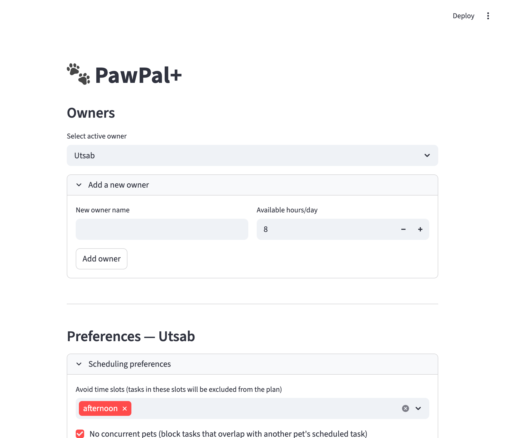

# PawPal+ (Module 2 Project)

You are building **PawPal+**, a Streamlit app that helps a pet owner plan care tasks for their pet.

## Scenario

A busy pet owner needs help staying consistent with pet care. They want an assistant that can:

- Track pet care tasks (walks, feeding, meds, enrichment, grooming, etc.)
- Consider constraints (time available, priority, owner preferences)
- Produce a daily plan and explain why it chose that plan

Your job is to design the system first (UML), then implement the logic in Python, then connect it to the Streamlit UI.

## What you will build

Your final app should:

- Let a user enter basic owner + pet info
- Let a user add/edit tasks (duration + priority at minimum)
- Generate a daily schedule/plan based on constraints and priorities
- Display the plan clearly (and ideally explain the reasoning)
- Include tests for the most important scheduling behaviors

## Features

### Two-mode task sorting
Tasks can be ordered two ways, selectable at plan-generation time via `generate_plan(sort_mode=...)`:
- **Priority mode** (`prioritize_tasks`): sorts by time-of-day slot first (morning → afternoon → evening → anytime), then by priority number (1 = highest) within each slot. Use this when importance should determine what gets scheduled.
- **Clock mode** (`sort_by_time`): sorts by slot, then by exact `start_time` ("HH:MM"), then by priority on ties. Untimed tasks (no `start_time`) sort to the top of their slot. Use this when a fixed appointment time must be honoured regardless of priority.

### Daily plan generation with time-budget enforcement
`generate_plan` assembles a `daily_plan` from all owner → pet → task data. Tasks are added one by one; `check_constraints` drops any task that would exceed the owner's `available_hours_per_day` budget. Owner preferences are applied first:
- **`avoid_time`**: any task whose `preferred_time` matches an avoided slot is excluded before sorting.
- **`no_concurrent_pets`**: timed tasks that overlap with another pet's already-scheduled task are skipped, preventing the owner from being in two places at once.

### Conflict detection
`detect_conflicts` scans the completed `daily_plan` using two independent strategies:
- **Timed overlap**: converts every `start_time` to minutes since midnight, computes `end = start + duration_minutes`, and flags every pair where the intervals overlap (`a.start < b.end AND b.start < a.end`). Catches both same-pet and cross-pet conflicts.
- **Slot overload**: groups untimed tasks by slot and sums their durations. Emits an `OVERLOAD` warning if the total exceeds the realistic budget for that slot (morning: 240 min, afternoon: 240 min, evening: 180 min, anytime: 60 min).

### Automatic recurrence for repeating tasks
`complete_task` marks a task done and, for recurring frequencies, immediately registers the next occurrence on the same pet:
- **Daily** tasks get a follow-up with `due_date = today + 1 day`.
- **Weekly** tasks get a follow-up with `due_date = today + 7 days`.
- **As-needed** tasks are marked complete with no follow-up created.

The next occurrence is a fresh `Task` copy (`is_completed=False`, updated `due_date`) ready to be picked up by the next `generate_plan` call.

### Filtering
- **`filter_by_pet(pet_name)`**: returns only the `ScheduledTask` entries for the named pet. Comparison is case-insensitive and trims whitespace, so `"luna"`, `"Luna"`, and `" Luna "` all match.
- **`filter_by_status(completed)`**: returns entries that are done (`True`) or pending (`False`), useful for showing progress through the day.

### Schedule reasoning
`explain_reasoning` returns a human-readable summary of why the plan was ordered the way it was — which sort mode was active, which slots were avoided, and how much of the time budget each task consumed. Each `ScheduledTask` also carries its own `reason` string so individual entries are self-documenting without re-running the planner.

## Getting started

### Setup

```bash
python -m venv .venv
source .venv/bin/activate  # Windows: .venv\Scripts\activate
pip install -r requirements.txt
```

### Suggested workflow

1. Read the scenario carefully and identify requirements and edge cases.
2. Draft a UML diagram (classes, attributes, methods, relationships).
3. Convert UML into Python class stubs (no logic yet).
4. Implement scheduling logic in small increments.
5. Add tests to verify key behaviors.
6. Connect your logic to the Streamlit UI in `app.py`.
7. Refine UML so it matches what you actually built.

### Smarter Scheduling

- Added feature that implements sorting logic based on start time of task and is able to folter results based on pet's name ans task completion status.
- It automates recurring tasks as a daily or weekly task is completed, a new instance is automatically created for next occurence. 
- It detect conflicts between tasks for the same pet or different pets for a Owner and adds Owner's preference to remove such conflicting tasks.
- Utilizes Owner's preference to avoid certain times for scheduling.

### Testing PawPal+

Run python -m pytest

The tests covers both happy paths and edge cases. Tests include tasks based on priorities, tasks sorted by time, tasks with exact same start times, back to back tasks with no conflicts, daily and weekly tasks creating a new instance for the next task, as-needed tasks with no follow up, filter based on pet with no tasks, and complete_task() for non existent pet, and testing owner's time availability with tasks.

Confidence level: 5

### Demo

- [ ] 